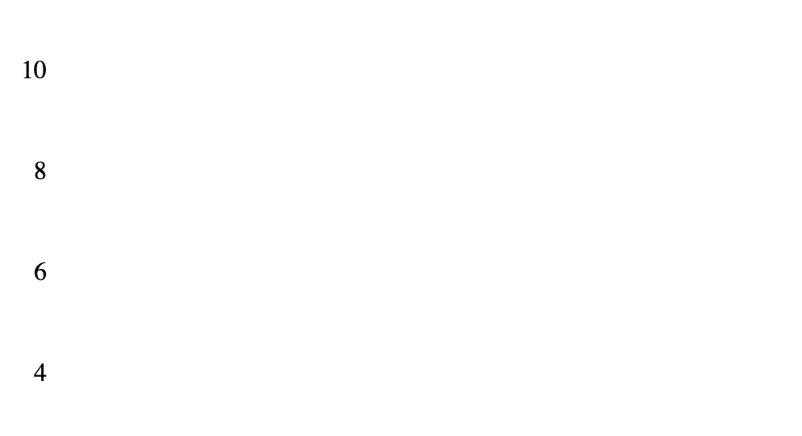
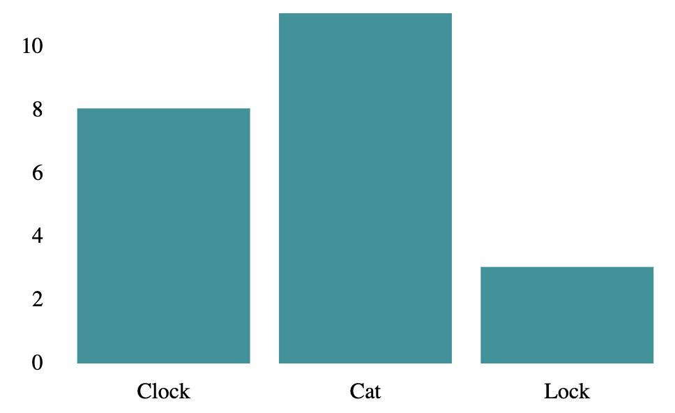
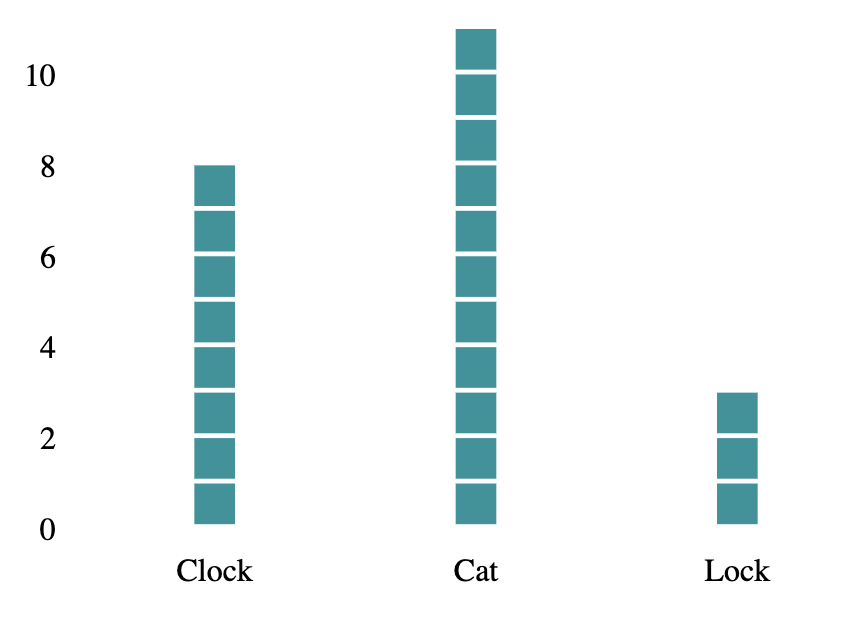
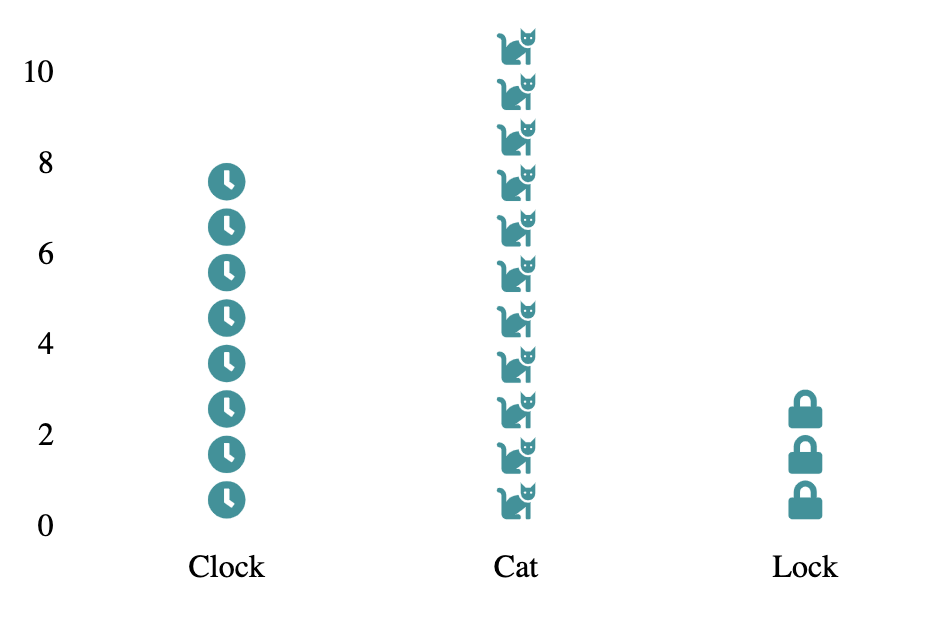
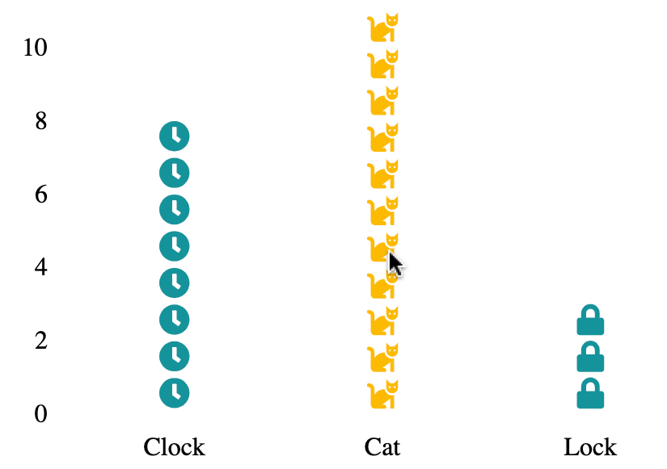

I'm a fan of the React graphing library [react-vis](https://uber.github.io/react-vis/). It's composable, so there's a lot you can do out of the box with minimal code required.

If you need more than what's offered by default, there's a couple of options:

1. Use the [CustomSVGSeries](https://uber.github.io/react-vis/documentation/series-reference/custom-svg-series), where you control what's rendered at what coordinates.
2. Build a custom series by extending the AbstractSeries component.

The second option is how all the out-of-the-box series provided by react-vis are made. However, it's not well documented -- by which I mean, there's exactly _one_ [passing reference to it](https://uber.github.io/react-vis/examples/charts/candlestick). However, if you want powerful functionality, but sometimes it's your only option. That's how we'll proceed for the rest of the article, where we build an [Isotype](http://steveharoz.com/research/isotype/) series.

## The Goal

Let's build an Isotype plot (like a bar chart, but with stacked images). We'll use [Font Awesome](https://fontawesome.com/) for our icons.

## Setting up Our Custom Chart

Let's start with our component, extending off `AbstractSeries`

```js
import React from 'react';

import { AbstractSeries } from 'react-vis';

export default class IsotypeSeries extends AbstractSeries {
  render() {
    return null;
  }
}
```

Here's how we can test it:

```js
import React from 'react';
import { FlexibleWidthXYPlot, XAxis, YAxis, LineSeries } from 'react-vis';
import IsotypeSeries from '.';

const data = [
  { x: 'Clock', y: 8 },
  { x: 'Cat', y: 11 },
  { x: 'Lock', y: 3 },
];

export const Chart = () => (
  <FlexibleWidthXYPlot height={300} xType="ordinal">
    <XAxis />
    <YAxis />
    <IsotypeSeries data={data} />
  </FlexibleWidthXYPlot>
);
```

It turns out, a component that returns `null` isn't particularly interesting:



## First Steps: Putting Rectangles on the Screen

A great starting point is mimicking the `VerticalBarSeries`. However, there's a lot in there we don't need, so here's a cut down version to get a working example:

```js
export default class IsotypeSeries extends AbstractSeries {
  static getParentConfig(attr) {
    return {
      isDomainAdjustmentNeeded: attr === 'x',
      zeroBaseValue: attr === 'y',
    };
  }

  render() {
    const { data, marginLeft, marginTop, style, barWidth = 0.85 } = this.props;

    if (!data) {
      return null;
    }

    const distance = this._getScaleDistance('x');
    const lineFunctor = this._getAttributeFunctor('x');
    const valueFunctor = this._getAttributeFunctor('y');
    const value0Functor = this._getAttr0Functor('y');
    const fillFunctor =
      this._getAttributeFunctor('fill') || this._getAttributeFunctor('color');
    const strokeFunctor =
      this._getAttributeFunctor('stroke') || this._getAttributeFunctor('color');
    const opacityFunctor = this._getAttributeFunctor('opacity');

    return (
      <g transform={`translate(${marginLeft},${marginTop})`}>
        {data.map((d, i) => {
          const totalSpace = lineFunctor(d);
          const spacePerBar = distance * barWidth;
          const middleOfBar = totalSpace - spacePerBar / 2;

          const attrs = {
            style: {
              opacity: opacityFunctor && opacityFunctor(d),
              stroke: strokeFunctor && strokeFunctor(d),
              fill: fillFunctor && fillFunctor(d),
              ...style,
            },
            x: middleOfBar,
            width: spacePerBar,
            y: Math.min(value0Functor(d), valueFunctor(d)),
            height: Math.abs(-value0Functor(d) + valueFunctor(d)),
            key: i,
          };
          return <rect {...attrs} />;
        })}
      </g>
    );
  }
}
```

Here's where we are:



## Rendering Columns of Shapes

Instead of rendering a rectangle, we want to render many icons per column.

To start, let's set up a function to render symbols, which we'll change later:

```js
renderSymbol(attrs) {
  return <rect {...attrs} />;
}
```

We'll stick to square icons, so let's rename `barWidth` to `scaleFactor`. Then, we can calculate the icon size:

```js
const heightPerIcon = Math.abs(valueFunctor({ y: 1 }) - value0Functor({}));
const widthPerIcon = this._getScaleDistance('x');
const size = Math.min(widthPerIcon, heightPerIcon) * scaleFactor;
```

Then the inner map in the render method can be written as:

```js
data.map((column, i) => {
  const dataPointsForColumn = Array(column.y)
    .fill()
    .map((_, i) => ({ ...column, y: i + 1 }));

  return dataPointsForColumn.map(d => {
    const attrs = {
      style: {
        opacity: opacityFunctor && opacityFunctor(d),
        stroke: strokeFunctor && strokeFunctor(d),
        fill: fillFunctor && fillFunctor(d),
        ...style,
      },
      x: lineFunctor(d) - size / 2,
      y: valueFunctor(d),
      width: size,
      height: size,
      key: `${d.x}-${d.y}`,
    };

    return this.renderSymbol(attrs);
  });
});
```

A few things to explain:

- We build `y` data-points for each data point. So, for `{ x: 'Cat', y: 11 }`, we build an array of 11 items, from `{ x: 'Cat', y: 1 }` all the way to `{ x: 'Cat', y: 11 }`.
- Then, we use the new data points to control `x` and `y` positions, and the prior-calculated `size` for both width and height

Here's what it looks like:



## Rendering Custom Icons

We're getting there. The final piece is to render custom icons per column.

Let's set up the series component to accept custom icon renderers:

```js
renderRectangle(attrs) {
  // Fallback if no icon is provided
  return <rect {...attrs} />;
}

renderSymbol(attrs) {
  const { icon: Icon = this.renderRectangle, ...rest } = attrs;
  return <Icon {...rest} />;
}
```

Then, we just have to change our `data` array to pass this through!

```js
import { FontAwesomeIcon } from '@fortawesome/react-fontawesome';
import { faClock, faCat, faLock } from '@fortawesome/free-solid-svg-icons';

// This can be whatever you like

const getCustomIcon = icon => props => (
  <FontAwesomeIcon {...props} icon={icon} />
);

const data = [
  { x: 'Clock', y: 8, icon: getCustomIcon(faClock) },
  { x: 'Cat', y: 11, icon: getCustomIcon(faCat) },
  { x: 'Lock', y: 3, icon: getCustomIcon(faLock) },
];
```

It's looking much better. Here's where we are:



## Final Touches: Adding Interaction

Let's add some interaction using `onMouseOver` / `onMouseOut` on our columns so we can display tooltips. Keep in mind, we could add whatever functionality we like, because we control the `IsotypeSeries` component.

First, we need to wrap all our icons for each `x` value inside a group `<g />`, so we can attach one event listener.

Then, to make sure the mouse over stays active for the whole time we're hovering in a column, and doesn't fire the mouse out event when our mouse is in the gaps between each icon, we need an _invisible_ rectangle covering the whole column. Given we started with a bar series, this shouldn't be too hard!

```js
const dataPointsForColumn = ...

return (
  <g
    key={column.x}
    onMouseOver={e => this._valueMouseOverHandler(column, e)}
    onMouseOut={e => this._valueMouseOutHandler(column, e)}
  >
    <rect
      x={lineFunctor(column) - size / 2}
      width={size}
      y={Math.min(value0Functor(column), valueFunctor(column))}
      height={Math.abs(-value0Functor(column) + valueFunctor(column))}
      fill="transparent"
    />

    {dataPointsForColumn.map(d => {
      const attrs = {
        style: {
          fill: d.fill || 'rgb(18, 147, 154)',
          ...style,
        },
        ...
      };

      return this.renderSymbol(attrs);
    })}
  </g>
);
```

Then, we need to change our chart component to set the handlers and update the data as appropriate:

```js
export const Chart = () => {
  const [activeColumn, setActiveColumn] = useState(null);

  const onMouseOver = column => {
    setActiveColumn(column.x);
  };

  const onMouseOut = () => {
    setActiveColumn(null);
  };

  const dataWithActiveState = useMemo(
    () =>
      data.map(item =>
        item.x === activeColumn ? { ...item, fill: '#fcba03' } : item
      ),
    [activeColumn]
  );

  return (
    <FlexibleWidthXYPlot height={300} xType="ordinal">
      <XAxis />
      <YAxis />
      <IsotypeSeries
        data={dataWithActiveState}
        onValueMouseOver={onMouseOver}
        onValueMouseOut={onMouseOut}
      />
    </FlexibleWidthXYPlot>
  );
};
```

Here's the final result:



See a [demo](https://aaronmoat.com/demos/?path=/story/isotype-series-custom-react-vis-chart--chart), or get [the full source code](https://github.com/AaronMoat/aaronmoat-blog/tree/master/stories/IsotypeSeries).
