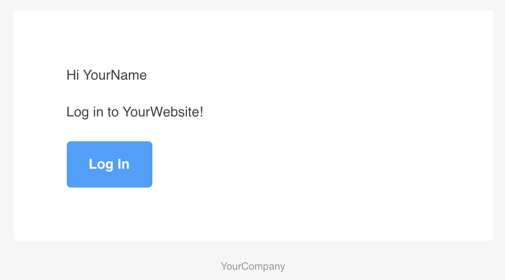

This is a short tutorial on building a simple email worker/sender with Node.js and AWS Lambda. It uses [Handlebars](https://handlebarsjs.com/) for basic templating and [Juice](https://github.com/Automattic/juice) so that you don't have to write inline CSS.

If you'd like to jump straight to the code, [here it is](https://github.com/AaronMoat/serverless-email-worker).

## Setting up the scaffolding

First, we'll need some cloudformation (using [Serverless Application Model](https://aws.amazon.com/serverless/sam/), or SAM, for simplicity).

Below sets up an AWS lambda function, and an SQS queue / dead letter queue (if the lambda function fails to send messages, they'll end up here). It also introduces some parameters, SenderName and SenderEmail, which we pass through as environment variables, so you can configure where the emails are coming from.

```yml
AWSTemplateFormatVersion: '2010-09-09'
Transform: AWS::Serverless-2016-10-31
Description: serverless-email-worker

Parameters:
  SenderName:
    Type: String

  SenderEmail:
    Type: String

Resources:
  EmailWorker:
    Type: AWS::Serverless::Function
    Properties:
      CodeUri: .
      Handler: handler.handler
      Runtime: nodejs12.x
      Timeout: 180
      Environment:
        Variables:
          SENDER_NAME: !Ref SenderName
          SENDER_EMAIL: !Ref SenderEmail
      Events:
        EmailQueueSQSEvent:
          Type: SQS
          Properties:
            Queue: !GetAtt EmailQueue.Arn
            BatchSize: 10
      Policies:
        - Version: '2012-10-17'
          Statement:
            - Effect: Allow
              Action:
                - ses:sendEmail
              Resource: '*'

  EmailQueue:
    Type: AWS::SQS::Queue
    Properties:
      RedrivePolicy:
        deadLetterTargetArn: !GetAtt EmailDLQ.Arn
        maxReceiveCount: 3
      VisibilityTimeout: 240

  EmailDLQ:
    Type: AWS::SQS::Queue
```

The code mentions `handler.handler`, so we'll need to make a `handler.js` file. This will make use of an EmailSender class, to come later, and those environment variables:

```js
const EmailSender = require('./EmailSender');

const sender = new EmailSender(
  `${process.env.SENDER_NAME} <${process.env.SENDER_EMAIL}>`
);

exports.handler = async function(event, context) {
  for (const record of event.Records) {
    await sender.send(JSON.parse(record.body));
  }
};
```

We'll also need a [package.json](https://github.com/AaronMoat/serverless-email-worker/blob/master/package.json).

## Creating the email templates

Before writing the `EmailSender` code, let's take a look at building the templates.

I based mine on [this template](https://github.com/leemunroe/responsive-html-email-template). I split this up into parts:

- [email.css](https://github.com/AaronMoat/serverless-email-worker/blob/master/email.css), containing all the styles for the email
- [partials/layout.hbs](https://github.com/AaronMoat/serverless-email-worker/blob/master/partials/layout.hbs), which contains some shared layout for the emails
- Specific templates, like for a login email template, at [templates/login/html.hbs](https://github.com/AaronMoat/serverless-email-worker/blob/master/templates/login/html.hbs). This is for the specific content of the email.

In addition, each template (like the login template), we need a [subject.hbs](https://github.com/AaronMoat/serverless-email-worker/blob/master/templates/login/subject.hbs) and [text.hbs](https://github.com/AaronMoat/serverless-email-worker/blob/master/templates/login/text.hbs) for the subject-line and the text-only version of the email.

These files can be anything you like, but the above is a good starting point. [My example](https://github.com/AaronMoat/serverless-email-worker/tree/master/templates) has two, very similar, templates, but you can tweak these to your own needs.

## Building the email sending logic

Let's start by making our class in `EmailSender.js`:

```js
const AWS = require('aws-sdk');
const juice = require('juice');
const handlebars = require('handlebars');
const fs = require('fs');
const path = require('path');

const SES = new AWS.SES();

module.exports = class {};
```

We'll need to set up the sender address (which we passed in from `handler.js`):

```js
module.exports = class {
  #senderAddress;

  constructor(senderAddress) {
    this.#senderAddress = senderAddress;
  }
};
```

If you haven't seen `#`, they're for private fields. These aren't strictly necessary, so they can be removed.

Next, we'll have to register the partial (layout.hbs) we made. This is so that when it comes to rendering the template, handlebars knows how to render the layout. This is as simple as calling `handlebars.registerPartial` for each partial.

```js
module.exports = class {
  #senderAddress;

  constructor(senderAddress, partialsPath = './partials') {
    this.#senderAddress = senderAddress;
    this.#registerPartials(partialsPath);
  }

  #registerPartials = partialsPath => {
    for (let template of fs.readdirSync(partialsPath)) {
      if (template.endsWith('.hbs')) {
        const name = template.split('.')[0];
        handlebars.registerPartial(
          name,
          fs.readFileSync(path.join(partialsPath, template)).toString()
        );
      }
    }
  };
};
```

Then, a method to send the email:

```js
performSend = async request => {
  return new Promise((resolve, reject) => {
    SES.sendEmail(request, (err, data) => {
      if (!err && data) {
        resolve();
      } else {
        reject(err);
      }
    });
  });
};
```

Next, we need to be able to render our templates. This means we'll need to store our juice options (to link to our CSS). We'll also need to compile the templates before rendering with them; an optimization, to avoid doing this each time, is to save the compiled template if we've seen it before.

```js
  #senderAddress;
  #juiceOptions;
  #preCompiledTemplates = {};

  constructor(senderAddress, partialsPath = "./partials") {
    this.#senderAddress = senderAddress;
    this.#juiceOptions = {
      extraCss: fs.readFileSync("./email.css").toString()
    };
    this.#preCompiledTemplates = {};

    this.#registerPartials(partialsPath);
  }

  #renderTemplate = async (templateName, partName, values) => {
    const path = `./templates/${templateName}/${partName}.hbs`;

    if (!this.#preCompiledTemplates[path]) {
      const template = await fs.promises.readFile(
        `./templates/${templateName}/${partName}.hbs`
      );

      this.#preCompiledTemplates[path] = handlebars.compile(
        template.toString()
      );
    }

    return this.#preCompiledTemplates[path](values);
  };
```

Finally, the `send` method combines these together and orchestrates it all:

```js
  send = async ({ templateName, email, values }) => {
    const [html, text, subject] = await Promise.all([
      this.#renderTemplate(templateName, "html", values),
      this.#renderTemplate(templateName, "text", values),
      this.#renderTemplate(templateName, "subject", values)
    ]);

    const request = {
      Source: this.#senderAddress,
      Destination: {
        ToAddresses: Array.isArray(email) ? email : [email]
      },
      Message: {
        Body: {
          Html: {
            Charset: "UTF-8",
            Data: juice(html, this.#juiceOptions)
          },
          Text: {
            Charset: "UTF-8",
            Data: text
          }
        },
        Subject: {
          Charset: "UTF-8",
          Data: subject
        }
      }
    };

    await this.performSend(request);
  };
```

## Testing the email templates locally

Now we've got a class to do the sending, we'd like to test our templates locally. I started with a `samples.json` that records the template name to test, and the handlebars variables to plug into the emails:

```json
[
  {
    "templateName": "login",
    "values": {
      "name": "YourName",
      "url": "https://google.com"
    }
  },
  {
    "templateName": "verify",
    "values": {
      "name": "YourName",
      "url": "https://google.com"
    }
  }
]
```

Then, in the `package.json`, I have:

```
"scripts": {
    "generate-sample-emails": "node generateSampleEmails.js"
},
```

Finally, we need a `generateSampleEmails.js` script to test the emails. Because there's no need to send real emails each time (this would get annoying), I've extended the `EmailSender` class to just write the html to a file.

```js
const fs = require('fs');
const AWS = require('aws-sdk');
const _EmailSender = require('./EmailSender');

const samples = JSON.parse(fs.readFileSync('samples.json'));

const outDir = 'sample_emails';

class EmailSender extends _EmailSender {
  performSend = async request => {
    fs.writeFileSync(
      `${outDir}/${this.currentTemplate}.html`,
      request.Message.Body.Html.Data
    );
  };
}

const emailSender = new EmailSender('noreply <noreply@email.com>');

async function generate() {
  if (!fs.existsSync(outDir)) {
    fs.mkdirSync(outDir);
  }

  for (const sample of samples) {
    emailSender.currentTemplate = sample.templateName;
    await emailSender.send({ ...sample, email: 'email@email.com' });
  }

  console.log('Templates written to', outDir);
}

generate();
```

This outputs files to a `sample_emails` folder. These can be inspected in Chrome, and look something like:



## Deploying

Great, we're ready to go. You'll need to set up a verified email or domain in the AWS console, and you may want to ask to move out of the SES sandbox (otherwise there are limits on who you can send emails to).

Once you're ready, you can use the [SAM CLI](https://docs.aws.amazon.com/serverless-application-model/latest/developerguide/serverless-sam-cli-install.html) to deploy your email worker! You'll need to make a bucket for the packaged assets, if you haven't used the SAM CLI before.

```sh
sam build
sam package --s3-bucket <your-packaging-assets-bucket> --s3-prefix serverless-email-worker --output-template-file .aws-sam/packaged.yml
sam deploy --template-file .aws-sam/packaged.yml --stack-name serverless-email-worker --capabilities CAPABILITY_IAM --parameter-overrides SenderName=<email sender name> SenderEmail=<email@address>
```

To test this, you can queue a message in the SQS console to your email queue, something like...

```json
{
  "templateName": "login",
  "email": "your@email",
  "values": {
    "name": "YourName",
    "url": "https://google.com"
  }
}
```

## Next Steps

You'll probably want to use the AWS SDK to send messages to the email queue from your application, rather than manually queueing messages.

Once you've done that, you've got a fully functioning email sender, and you can add templates in the `templates` folder to extend.

---

Get [the full source code](https://github.com/AaronMoat/serverless-email-worker).
